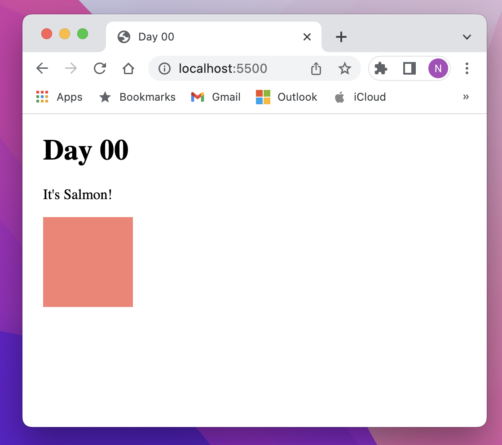

## Day 00
**Date:** 12/16/2022  
**Site:**  

Yesterday, I showed you how to make a website. Today, I want you to make one on your own!

This is the site I want you to recreate:

Here are a few requirements:
- The entire website needs to be in a single html file named `index.html`. No external CSS or JS can be used.
- The browser tab for this website should say "Day 00".
- The block should be 100px wide and 100px tall. (Do not use SVG or an image, make the block from a div)
- Site must be deployed on Github Pages. Update this Readme and add the link to the top. (tricky!)