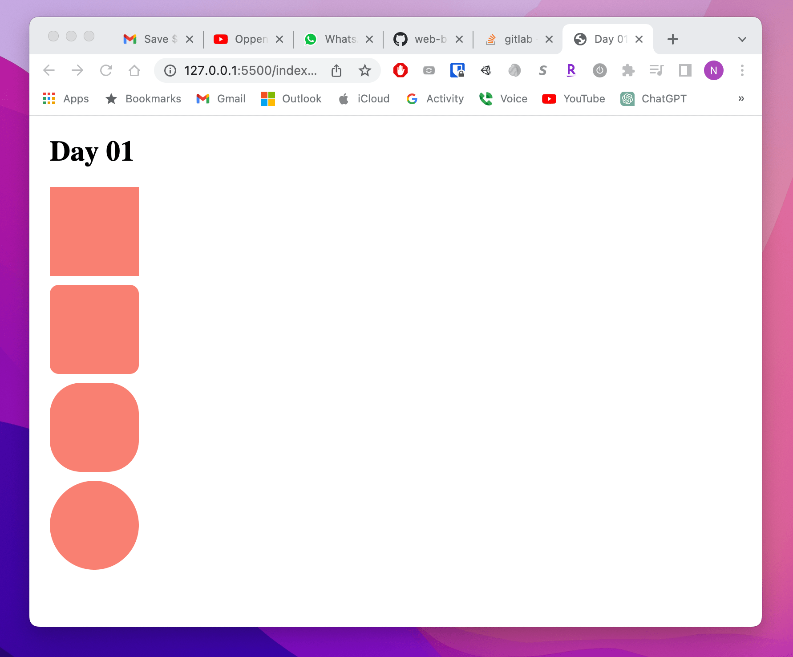

## Day 01

**Date:** 12/19/2022  
**Site: **   <https://jamt23.github.io/web-basics/challenges/day-01/index.html>

For today's assignment, I want you to try and match the image below as closely as possible.

Here are a few requirements:
- The entire website needs to be in a single html file named `index.html`.
- No external CSS or JS can be used.
- No inline CSS can be used.
- The browser tab for this website should say "Day 01".
- The shapes should be 100px wide and 100px tall. (Do not use SVG or an image, make the block from a div)
- Site must be deployed on Github Pages. Update this Readme and add the link to the top.

Tips

 
Only view this if you're stuck!
  

 I won't say what property this applies to, but here are the values I used: 0, 10px, 35%, 50%.

